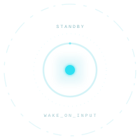

<p align="center">
  
</p>

<p align="center">
  
</p>

<p align="center">
  <a href="https://github.com/harshil342/J.A.R.V.I.S-Desk-Pet/releases/latest"></a>
  
  
  
  <a href="./LICENSE"></a>
</p>

<h3 align="center">
  ⚡ The Autonomous, Local-First AI Desktop Companion &amp; Coding Supervisor
</h3>

<p align="center">
  <strong>J.A.R.V.I.S. Desk Pet</strong> is an ultra-fast, on-device AI companion that lives right on your desktop. Built with sub-15ms screen OCR perception, long-term episodic memory, native <strong>Model Context Protocol (MCP)</strong> tooling, and zero-latency local model inference with <strong>$0 token cost</strong>.
</p>

<p align="center">
  <a href="https://github.com/harshil342/J.A.R.V.I.S-Desk-Pet/releases/latest"><strong>⬇️ Download for Windows (.exe)</strong></a>
  &nbsp;•&nbsp;
  <a href="https://github.com/harshil342/J.A.R.V.I.S-Desk-Pet/releases/latest"><strong>⬇️ Download for macOS (.dmg)</strong></a>
  &nbsp;•&nbsp;
  <a href="#-getting-started"><strong>🚀 Quickstart</strong></a>
  &nbsp;•&nbsp;
  <a href="#-quantized-models--hardware-matrix"><strong>📊 Model Benchmarks</strong></a>
</p>

---

## 💎 Why Developers Choose J.A.R.V.I.S.

| Advantage | J.A.R.V.I.S. Desk Pet | Cloud AI Tools (ChatGPT / Claude) |
| :--- | :--- | :--- |
| **🔒 Air-Gapped Privacy** | **100% On-Device.** Code, terminal outputs, and credentials never touch external servers. | Sensitive code & chat history sent to third-party cloud data centers. |
| **⚡ Zero-Copy Perception** | **Sub-15ms Local OCR.** Reads compiler errors, active IDE files, and windows automatically. | Requires manual copy-pasting or upload of multi-megabyte screenshots. |
| **💸 $0 Cost / Unlimited Tokens** | **Free Forever.** Runs indefinitely on your local hardware with 0 subscriptions or API keys. | Monthly $20+ subscriptions or metered per-token API charges. |
| **🔌 Native MCP Ecosystem** | **Open Model Context Protocol.** Plug in any community or internal MCP server over stdio. | Restricted plugins with strict approval barriers. |
| **🧠 Episodic Semantic Memory** | **Persistent Fact Store.** Automatically recalls environment configs, ports, and preferences. | Context lost between chat resets or requires manual system prompt editing. |
| **⏰ Proactive Workflows** | **Background Task Dispatcher.** Schedules async timers with native Windows Toast alerts. | Purely reactive—cannot alert you when you are away from the tab. |
| **🖥️ Ambient Desktop Presence** | **Interactive Pet & Edge-Dock Mini Mode.** Stays in your peripheral vision reacting to code tasks. | Trapped in a browser tab or buried behind windows. |

---

## 🎯 High-Impact Developer Use Cases

```
  ┌────────────────────────────────────────────────────────────────────────────────────────┐
  │                               ZERO-COPY DEBUGGING FLOW                                 │
  │                                                                                        │
  │  [IDE / Terminal Error]  ──(15ms OCR)──►  [J.A.R.V.I.S. Core]  ──►  [Instant 2-Sentence │
  │   Stack Trace on Screen                     Local Brain                  Fix in Bubble]│
  └────────────────────────────────────────────────────────────────────────────────────────┘
```

### 1. Zero-Copy Terminal & Compiler Error Debugging
> *"What does the error on my screen mean?"*
- J.A.R.V.I.S. reads your active IDE window, extracts the visible stack trace via native OCR in <15ms, and posts a clear, actionable fix into its speech bubble without you ever touching `Ctrl+C` / `Ctrl+V`.

### 2. Autonomous Background Agent Supervision
- While background tools (Cursor, Claude Code, Codex, Antigravity) run heavy multi-file builds, J.A.R.V.I.S. tracks execution states, animates working routines, and pops a toast notification the instant the task finishes or breaks.

### 3. Proactive Timers & Background Alerts
> *"Remind me to check the deployment in 15 minutes"*
- Schedules asynchronous background tasks into its persistent JSON store. Reminders survive app restarts and fire native OS toast notifications on completion.

### 4. Semantic Long-Term Knowledge Recall
> *"Remember that our staging database is on port 5433"* ➔ *"What port does staging use?"*
- Hybrid semantic memory retrieves relevant technical notes, credentials, and project instructions using TF-IDF + cosine concept matching.

---

## 🐾 Meet The 3 J.A.R.V.I.S. Companions

Choose from our three dedicated J.A.R.V.I.S. companion models—each handcrafted for specific developer workflows with custom CSS-animated SVG vector models:

| Companion Model | Vector Avatar | Role & Capabilities | Ideal Workflow |
| :--- | :---: | :--- | :--- |
| **Plain J.A.R.V.I.S.** |  | **The Core Intelligent Companion.** Holographic Arc-Reactor HUD desktop sentinel equipped with instant screen OCR, active window context, background agent monitoring, and rapid stack trace diagnosis. | Daily coding, build monitoring, pair programming. |
| **J.A.R.V.I.S. R** |  | **The Deep Reasoning &amp; Research Specialist.** High-intensity thinking companion with live `QUERY... / PARSE_MODE` telemetry, quantum core flare, deep chain-of-thought analysis, and semantic memory recall. | Architectural planning, complex debugging, deep reasoning. |
| **J.A.R.V.I.S. Mark** |  | **The High-Velocity Action &amp; Tactical Sentinel.** MAKO-9 cyber-drone with dark gunmetal hull, cyan visor optics, and wizard-grade execution for multi-step MCP tools, document generation, and system operations. | DevOps automation, script execution, high-velocity workflows. |

---

### 🛸 All Project J.A.R.V.I.S. Themes & State Animations

Explore the full collection of real-time animated vector themes created for this project:

#### 1. Arc Reactor HUD Suite (`jarvis-arc`)
| Idle Orbit | Deep Reasoning (`QUERY`) | Active Stream (`PROCESSING`) |
| :---: | :---: | :---: |
|  |  |  |
| *Concentric spinning rings &amp; hex frame* | *High-speed dotted parse &amp; query orbit blip* | *Flared core, radar scanline &amp; data burst* |

| Priority Focus (`ATTENTION`) | System Breach (`ALERT`) | Low-Power Standby (`SLEEP`) |
| :---: | :---: | :---: |
|  |  |  |
| *Target lock scan with strobe telemetry* | *Crimson alert perimeter &amp; pulse flare* | *Low-frequency pulse &amp; dimmed energy grid* |

#### 2. MAKO-9 Cyber-Drone Suite (`jarvis`)
| Patrol Hover | Quantum Synthesis | High-Throughput Compute |
| :---: | :---: | :---: |
|  |  |  |
| *Stabilizer fin motion &amp; arc aura* | *Holographic ring with orbiting data blocks* | *Dual particle discharge &amp; core glow* |

| Target Lock (`ATTENTION`) | Diagnostic Breach (`ALERT`) | Low-Power Hibernate (`SLEEP`) |
| :---: | :---: | :---: |
|  |  |  |
| *Optic visor focus with tactical targeting* | *Warning strobe &amp; hull telemetry breach* | *Dorsal beacon power-down &amp; grounded rest* |

#### 3. J.A.R.V.I.S. Classic Interface (`jarvis-classic`)
| Classic Arc Core | Classic Telemetry | High-Load Processing |
| :---: | :---: | :---: |
|  |  |  |
| *10-point mechanical notch ring &amp; cyan core* | *Telemetry parse sweep &amp; rotating orbit* | *Multi-arc flare &amp; high-output core glow* |

> 💡 **Custom Personas & Skins**: Switch companion styles, import custom `.zip` sprite packs, or load fine-tuned LoRA adapters directly in **Settings ➔ Deskpet Assistant**.

---

## 📊 Quantized Models & Hardware Matrix

J.A.R.V.I.S. runs on an optimized **1B Edge Language Model architecture** designed for extreme token efficiency and instant response times:

### Model Quantization Tiers

| Quantization Format | File Size | Memory Footprint (RAM / VRAM) | Recommended Hardware | Generation Speed |
| :--- | :--- | :--- | :--- | :--- |
| **Q4_K_M (Fast / Lightweight)** | ~780 MB | **~1.2 GB Total** | Intel/AMD Integrated Graphics, Older Laptops | **65+ tokens/sec** |
| **Q8_0 (Canonical Production Default)** | ~1.15 GB | **~1.8 GB Total** | Modern Laptops, GTX 1650+, Apple Silicon M-Series | **48+ tokens/sec** |
| **FP16 (Full Precision)** | ~2.10 GB | **~3.2 GB Total** | Dedicated GPUs (RTX 3060+, Apple Silicon 16GB+) | **35+ tokens/sec** |

### Hardware Acceleration Support

```
  ┌──────────────────┐      ┌──────────────────┐      ┌──────────────────┐
  │   NVIDIA CUDA    │      │    Vulkan GPU    │      │   Universal CPU  │
  │  RTX 20/30/40/50 │      │ AMD Radeon / Arc │      │ AVX2 / AVX-512   │
  │ Hardware Compute │      │ Cross-Vendor GPU │      │ Fallback Layer   │
  └──────────────────┘      └──────────────────┘      └──────────────────┘
```

- **NVIDIA GPUs**: Native CUDA backend with bundled cuBLAS runtime acceleration.
- **AMD & Intel GPUs**: High-performance Vulkan backend for broad GPU support.
- **Apple Silicon**: Metal backend leveraging unified memory architecture on macOS.
- **Universal CPU Fallback**: Automatically switches to multi-threaded CPU inference if no dedicated GPU is detected.

---

## 🛠️ Built-in Micro-Tools & External APIs Catalog

J.A.R.V.I.S. includes a comprehensive suite of **native micro-tools** and **live zero-key API integrations** executed deterministically via `safe_tool_call` before response generation:

| Tool Identifier | Category | Underlying Provider / API | Authentication | Key Capabilities & Features |
| :--- | :--- | :--- | :--- | :--- |
| **`get_weather`** | 🌦️ Weather | [**Open-Meteo API**](https://open-meteo.com/) (`/v1/forecast`) & Open-Meteo Geocoding (Fallback: `ipapi.co`) | None (Free / Open API) | Live temperature (°C), apparent feels-like, humidity %, wind speed, WMO weather descriptions for any city or automatic location. |
| **`web_search`** | 🔍 Web Search | [**DuckDuckGo Instant Answers API**](https://api.duckduckgo.com/) | None (Zero-key) | Fast encyclopedic lookups, entity abstracts, official documentation links, and zero-click answer summaries. |
| **`wikipedia_summary`**| 📚 Knowledge | [**Wikipedia REST API**](https://en.wikipedia.org/api/rest_v1/) & MediaWiki Full-Text Search | None (Zero-key) | Relevance-ranked article search, introductory abstracts, historical figures, science, and technical concepts. |
| **`convert_currency`** | 💱 Finance | [**ExchangeRate-API**](https://open.er-api.com/) (`open.er-api.com/v6/latest/`) | None (Live Exchange) | Real-time currency conversions across 160+ fiat currencies (USD, EUR, INR, GBP, JPY) and crypto (BTC, ETH). |
| **`fetch_page`** | 🌐 Mini-RAG | **HTTPX Fetch Engine** + Clean HTML Parser | None (Local RAG) | Fetches arbitrary web pages / technical documentation, strips noise, and streams cleaned text to the local LLM for instant summarization. |
| **`calculate`** | 🧮 Math Engine | **Python AST Sandbox Evaluator** (No `eval()`) | Offline (Deterministic) | Order of operations, `sqrt`, trigonometry (`sin`, `cos`, `tan`), `log`, `pow`, percentages with zero hallucination. |
| **`convert_units`** | 📐 Measurements | **Built-in Physical Unit Matrices** | Offline (Deterministic) | Converts length (m, km, mi, ft, in), mass/weight (kg, g, lbs, oz), temperature (°C, °F, K), digital data (bytes to TB), and speed (km/h, mph, knots). |
| **`get_time`** | ⏰ Clock | **Local System RTC** | Offline | Exact local date, 24-hour time, and day of the week. |
| **`launch_app`** | 🚀 App Launcher | **Win32 App Paths Registry**, Start Menu `.lnk` Parser, Protocol URIs | Native OS | Launches developer IDEs (VS Code, Terminal), desktop apps (Spotify, Discord, Notepad, Calc), Windows Settings (`ms-settings:`), or web fallbacks. |
| **`create_document`** | 📝 Documents | **Local Markdown Template Engine** (`Documents/DeskPet/`) | Offline | Generates structured templates for `meeting_notes`, `readme`, `video_script`, `changelog`, `todo_list`, `email`, or general `document`. |
| **`set_reminder`** | 🔔 Proactive Alerts | **Durable JSON Store** (`pending-reminders.json`) + `winotify` Toasts | Native Windows Toasts | Background timers surviving app reboots, auto-rearming on launch, desktop companion notification push. |
| **`todo_*`** | ✅ Task Manager | **Persistent Markdown Ledger** (`Documents/DeskPet/todo.md`) | Offline | Add, list, check off, remove, and clear tasks. Supports morning briefings and evening summaries. |
| **`system_status`** | 📊 Diagnostics | **`psutil` Hardware Engine** | Offline | Real-time CPU usage %, RAM utilization (MB/GB), battery status/level %, disk usage, and boot uptime. |
| **`clipboard_assist`**| 📋 Clipboard | **PowerShell / `xclip` Bridge** with Image Guard | Local OS | Reads copied clipboard text to summarize, explain errors, translate, or format without manually pasting into chat. |
| **`remember_fact`** / **`recall_fact`** | 🧠 Memory | **Semantic Vector Store (TF-IDF + Cosine)** + `notes.md` | Local Hybrid Vector | Retains developer ports, staging credentials, personal notes, preferences, and recalls them contextually. |
| **`get_active_window`** / **`read_screen_text`** | 👁️ Zero-Copy OCR | **Local Screen Perception & Win32 Window Inspector** | Offline (<15ms OCR) | Reads compiler errors, stack traces, active file paths, and focused window titles directly from the screen. |
| **`media_control`** | 🎵 Media Keys | **Windows Shell WScript COM `SendKeys`** | Native OS | Hardware volume adjustments (`volume_up`, `volume_down`, `mute`) and playback control (`play_pause`, `next`, `prev`). |
| **`take_screenshot`** | 📸 Screen Capture | **System Drawing / VirtualScreen API** | Offline | Captures full multi-monitor desktop screenshots and saves timestamped PNGs to `Documents/DeskPet/`. |
| **`lock_workstation`**| 🔒 Security | **Windows `user32.dll,LockWorkStation`** | Native OS | Instantly locks the workstation. |
| **`mcp_*`** | 🔌 MCP Tools | **Model Context Protocol JSON-RPC 2.0 Client** | Extensible Stdio | Dynamically discovers and invokes tools from any connected MCP server (Filesystem, GitHub, SQLite, PostgreSQL, Brave Search). |

---

## 💻 System Requirements

| Specification | Minimum Specification | Recommended Specification |
| :--- | :--- | :--- |
| **Operating System** | Windows 10/11 (64-bit) or macOS 13.0+ | Windows 11 (64-bit) or macOS 14.0+ (Apple Silicon) |
| **Processor** | Intel Core i5 (8th Gen+) / AMD Ryzen 3000+ | Intel Core i7 / AMD Ryzen 5000+ or Apple M1/M2/M3/M4 |
| **RAM** | 8 GB System Memory | 16 GB System Memory |
| **Graphics** | DirectX 12 / Vulkan capable iGPU | NVIDIA GeForce RTX 3050+ or Apple Silicon GPU |
| **Free Storage** | 3.0 GB SSD space | 5.0 GB NVMe SSD space |

---

## 🚀 Getting Started

### ⚡ Instant 1-Line Terminal Quickstart

Install and launch J.A.R.V.I.S. straight from your terminal with zero browser friction:

```powershell
# 🪟 Windows PowerShell (Run as User)
iwr -useb https://raw.githubusercontent.com/harshil342/J.A.R.V.I.S-Desk-Pet/main/scripts/install.ps1 | iex
```

---

### 1. Direct Installer Downloads

#### 🪟 Windows Installation
1. Download [**`Deskpet-0.11.0-x64.exe`**](https://github.com/harshil342/J.A.R.V.I.S-Desk-Pet/releases/download/v0.11.0/Deskpet-0.11.0-x64.exe) (or [**`ARM64`**](https://github.com/harshil342/J.A.R.V.I.S-Desk-Pet/releases/download/v0.11.0/Deskpet-0.11.0-arm64.exe)) from [Latest Releases](https://github.com/harshil342/J.A.R.V.I.S-Desk-Pet/releases/latest).
2. Run the installer and launch **Deskpet**.
3. The guided first-run onboarding wizard will automatically configure your local hardware backend and fetch weights.

#### 🍎 macOS Installation
1. Download [**`Deskpet-0.11.0-arm64.dmg`**](https://github.com/harshil342/J.A.R.V.I.S-Desk-Pet/releases/download/v0.11.0/Deskpet-0.11.0-arm64.dmg) (Apple Silicon) or [**`Intel x64`**](https://github.com/harshil342/J.A.R.V.I.S-Desk-Pet/releases/download/v0.11.0/Deskpet-0.11.0-x64.dmg) from [Latest Releases](https://github.com/harshil342/J.A.R.V.I.S-Desk-Pet/releases/latest).
2. Drag **Deskpet** into your `Applications` folder and launch.

#### 🐧 Linux Installation
1. Download [**`Deskpet-0.11.0-x86_64.AppImage`**](https://github.com/harshil342/J.A.R.V.I.S-Desk-Pet/releases/download/v0.11.0/Deskpet-0.11.0-x86_64.AppImage) or [**`.deb`**](https://github.com/harshil342/J.A.R.V.I.S-Desk-Pet/releases/download/v0.11.0/Deskpet-0.11.0-amd64.deb).
2. Make executable (`chmod +x Deskpet-0.11.0-x86_64.AppImage`) and run.

---

### ⌨️ Global Hotkeys & Shortcuts

| Shortcut (Windows / Linux) | Shortcut (macOS) | Action & Behavior |
| :--- | :--- | :--- |
| <kbd>Ctrl</kbd> + <kbd>Shift</kbd> + <kbd>M</kbd> | <kbd>Cmd</kbd> + <kbd>Shift</kbd> + <kbd>M</kbd> | **Toggle J.A.R.V.I.S. Chat Bubble** — Instant keyboard-first prompt overlay. |
| <kbd>Ctrl</kbd> + <kbd>Shift</kbd> + <kbd>D</kbd> | <kbd>Cmd</kbd> + <kbd>Shift</kbd> + <kbd>D</kbd> | **Instant Zero-Click Screen Diagnosis** — Runs <15ms OCR on active IDE window & speaks fix. |
| <kbd>Ctrl</kbd> + <kbd>Shift</kbd> + <kbd>T</kbd> | <kbd>Cmd</kbd> + <kbd>Shift</kbd> + <kbd>T</kbd> | **Toggle Deep Reasoning Mode** — Engages high-intensity chain-of-thought analysis. |
| <kbd>Esc</kbd> | <kbd>Esc</kbd> | **Dismiss Bubble / Return to Idle**. |
| **Right-Click Pet** | **Right-Click Pet** | **Context Menu** — Settings, Persona LoRAs, Model Manager, Mini-Dock Mode. |

---

### 🔊 Sci-Fi HUD Audio & Tactile Feedback

J.A.R.V.I.S. features subtle, non-intrusive futuristic audio feedback:
- **Arc-Reactor Chime**: Confirms waking up and hotkey triggers.
- **Completion Pulse**: Alerts when a long-running background build, test run, or timer concludes.
- *Can be toggled or muted instantly from **Settings ➔ Audio & Feedback**.*

---

### 💻 Terminal CLI Companion (`deskpet`)

Control J.A.R.V.I.S. directly from your favorite terminal (PowerShell, Windows Terminal, Bash, Zsh, Neovim):

```bash
# Query J.A.R.V.I.S. without leaving your terminal
deskpet "explain why git rebase failed"

# Check system hardware & pet status
deskpet status

# Schedule background proactive reminder
deskpet "remind me in 20 minutes to check deployment logs"
```

---

## 🔌 Open Model Context Protocol (MCP) & REST API

Connect any external MCP tool server over standard stdio JSON-RPC 2.0. Configure `Documents/DeskPet/mcp_servers.json`:

```json
[
  {
    "name": "filesystem",
    "command": "npx",
    "args": ["-y", "@modelcontextprotocol/server-filesystem", "C:\\Projects"],
    "enabled": true
  },
  {
    "name": "github",
    "command": "npx",
    "args": ["-y", "@modelcontextprotocol/server-github"],
    "env": {
      "GITHUB_PERSONAL_ACCESS_TOKEN": "ghp_..."
    },
    "enabled": true
  }
]
```

### Sidecar REST Endpoints (`http://127.0.0.1:18765`)
- `POST /api/chat` — Streaming chat with auto-tool execution and thought-bubble responses.
- `GET /api/mcp/servers` — List registered MCP servers and connection status.
- `POST /api/mcp/servers` — Dynamically connect a new MCP server.
- `POST /api/tasks` — Create asynchronous background timers and proactive alerts.
- `POST /api/memory/search` — Query semantic memory store.

---

## 🧪 Quality & Test Verification Matrix

J.A.R.V.I.S. Desk Pet is rigorously verified with **4,618 automated tests** passing with 0 failures across both the Electron desktop shell and the Python FastAPI sidecar gateway:

```
========================================================================================
                              OFFICIAL VERIFICATION SCOREBOARD
========================================================================================
 Suite Layer                 | Passed   | Failed | Skipped | Test Suites / Files
-----------------------------+----------+--------+---------+----------------------------
 Electron & UI Runtime       | 4,374    | 0      | 12      | 496 suites (1,247 test units)
 Python FastAPI Gateway      | 244      | 0      | 2       | 246 test items
-----------------------------+----------+--------+---------+----------------------------
 TOTAL VERIFIED TESTS        | 4,618    | 0      | 14      | 100% Passing Pass Rate
========================================================================================
```

### Reproduce Test Verification

```powershell
# 1. Run the complete Electron & J.A.R.V.I.S. test suite (4,374 tests)
cd clawd-on-desk && node test/run-tests.js

# 2. Run Python FastAPI Gateway test suite (244 tests)
uv run --project minicpm-sidecar pytest minicpm-sidecar/tests
```

---

## 🛡️ Dual-Mode Butler Architecture (Online Relay vs Air-Gapped)

To eliminate the hallucination risks inherent in small on-device models (0.9B–1B parameters), J.A.R.V.I.S. employs a dual-mode butler architecture:

```
                         ┌───────────────────────────┐
                         │   User / Voice / Prompt   │
                         └─────────────┬─────────────┘
                                       │
                         ┌─────────────▼─────────────┐
                         │  Fast Internet Probe      │
                         │  (500ms Socket Check)     │
                         └──────┬─────────────┬──────┘
                                │             │
                    [Online]    │             │   [Offline / Air-Gapped]
                                ▼             ▼
     ┌────────────────────────────┐         ┌────────────────────────────┐
     │  ONLINE BUTLER RELAY       │         │  OFFLINE AIR-GAPPED CORE   │
     ├────────────────────────────┤         ├────────────────────────────┤
     │ • Live Web Search RAG      │         │ • Strict No-Hallucination  │
     │ • DuckDuckGo HTML Snippets │         │   System Boundary Prompt   │
     │ • Wikipedia Intent Lookup  │         │ • Polite refusal on web    │
     │ • Live Weather & Currency  │         │   lookups / current events │
     │ • Model grounds answers    │         │ • Full local execution:    │
     │   in verified web data     │         │   Math, To-Do, System      │
     └────────────────────────────┘         │   Status, Local Notes, Time│
                                            └────────────────────────────┘
```

1. **Online Mode (The Digital Butler & Relay)**:
   - When connected, J.A.R.V.I.S. acts as an articulate digital butler and information relay.
   - External technical queries, current news, and package documentation are retrieved live via DuckDuckGo and Wikipedia before prompt construction.
   - The 1B local model synthesizes and formats the retrieved facts into a concise response without guessing.

2. **Offline Mode (Air-Gapped Local Assistant)**:
   - When no internet connection is detected, J.A.R.V.I.S. dynamically injects an air-gapped system boundary prompt.
   - The model politely and transparently informs the user that it does not possess external real-time knowledge due to operating offline.
   - All local deterministic tools (`calculate`, `get_time`, `todo_add`, `system_status`, `remember_fact`, `launch_app`) continue to execute with zero latency.

---

## 📄 License & Credits

Distributed under the [GNU AGPL-3.0-only](./LICENSE).  
MiniCPM model weights are licensed under the [OpenBMB MiniCPM Model License](https://github.com/OpenBMB/MiniCPM/blob/main/MiniCPM%20Model%20License.md).
