<p align="center">
  
</p>

<p align="center">
  
</p>

<p align="center">
  <a href="https://github.com/harshil342/J.A.R.V.I.S-Desk-Pet/releases/latest"></a>
  
  
  
  <a href="./LICENSE"></a>
</p>

<h3 align="center">
  ⚡ The Autonomous, Local-First AI Desktop Companion &amp; Coding Supervisor
</h3>

<p align="center">
  <strong>J.A.R.V.I.S. Desk Pet</strong> is an ultra-fast, on-device AI companion that lives right on your desktop. Built with sub-15ms screen OCR perception, long-term episodic memory, native <strong>Model Context Protocol (MCP)</strong> tooling, and zero-latency local model inference with <strong>$0 token cost</strong>.
</p>

<p align="center">
  <a href="https://github.com/harshil342/J.A.R.V.I.S-Desk-Pet/releases/latest"><strong>⬇️ Download for Windows (.exe)</strong></a>
  &nbsp;•&nbsp;
  <a href="https://github.com/harshil342/J.A.R.V.I.S-Desk-Pet/releases/latest"><strong>⬇️ Download for macOS (.dmg)</strong></a>
  &nbsp;•&nbsp;
  <a href="#-getting-started"><strong>🚀 Quickstart</strong></a>
  &nbsp;•&nbsp;
  <a href="#-quantized-models--hardware-matrix"><strong>📊 Model Benchmarks</strong></a>
</p>

---

## 💎 Why Developers Choose J.A.R.V.I.S.

| Advantage | J.A.R.V.I.S. Desk Pet | Cloud AI Tools (ChatGPT / Claude) |
| :--- | :--- | :--- |
| **🔒 Air-Gapped Privacy** | **100% On-Device.** Code, terminal outputs, and credentials never touch external servers. | Sensitive code & chat history sent to third-party cloud data centers. |
| **⚡ Zero-Copy Perception** | **Sub-15ms Local OCR.** Reads compiler errors, active IDE files, and windows automatically. | Requires manual copy-pasting or upload of multi-megabyte screenshots. |
| **💸 $0 Cost / Unlimited Tokens** | **Free Forever.** Runs indefinitely on your local hardware with 0 subscriptions or API keys. | Monthly $20+ subscriptions or metered per-token API charges. |
| **🔌 Native MCP Ecosystem** | **Open Model Context Protocol.** Plug in any community or internal MCP server over stdio. | Restricted plugins with strict approval barriers. |
| **🧠 Episodic Semantic Memory** | **Persistent Fact Store.** Automatically recalls environment configs, ports, and preferences. | Context lost between chat resets or requires manual system prompt editing. |
| **⏰ Proactive Workflows** | **Background Task Dispatcher.** Schedules async timers with native Windows Toast alerts. | Purely reactive—cannot alert you when you are away from the tab. |
| **🖥️ Ambient Desktop Presence** | **Interactive Pet & Edge-Dock Mini Mode.** Stays in your peripheral vision reacting to code tasks. | Trapped in a browser tab or buried behind windows. |

---

## 🎯 High-Impact Developer Use Cases

```
  ┌────────────────────────────────────────────────────────────────────────────────────────┐
  │                               ZERO-COPY DEBUGGING FLOW                                 │
  │                                                                                        │
  │  [IDE / Terminal Error]  ──(15ms OCR)──►  [J.A.R.V.I.S. Core]  ──►  [Instant 2-Sentence │
  │   Stack Trace on Screen                     Local Brain                  Fix in Bubble]│
  └────────────────────────────────────────────────────────────────────────────────────────┘
```

### 1. Zero-Copy Terminal & Compiler Error Debugging
> *"What does the error on my screen mean?"*
- J.A.R.V.I.S. reads your active IDE window, extracts the visible stack trace via native OCR in <15ms, and posts a clear, actionable fix into its speech bubble without you ever touching `Ctrl+C` / `Ctrl+V`.

### 2. Autonomous Background Agent Supervision
- While background tools (Cursor, Claude Code, Codex, Antigravity) run heavy multi-file builds, J.A.R.V.I.S. tracks execution states, animates working routines, and pops a toast notification the instant the task finishes or breaks.

### 3. Proactive Timers & Background Alerts
> *"Remind me to check the deployment in 15 minutes"*
- Schedules asynchronous background tasks into its persistent JSON store. Reminders survive app restarts and fire native OS toast notifications on completion.

### 4. Semantic Long-Term Knowledge Recall
> *"Remember that our staging database is on port 5433"* ➔ *"What port does staging use?"*
- Hybrid semantic memory retrieves relevant technical notes, credentials, and project instructions using TF-IDF + cosine concept matching.

---

## 🐾 Meet The 3 J.A.R.V.I.S. Companions

Choose from our three dedicated J.A.R.V.I.S. companion models—each handcrafted for specific developer workflows:

| Companion Model | Vector Avatar | Role & Capabilities | Ideal Workflow |
| :--- | :---: | :--- | :--- |
| **Plain J.A.R.V.I.S.** |  | **The Core Intelligent Companion.** Holographic desktop sentinel equipped with instant screen OCR, active window context, background agent monitoring, and rapid stack trace diagnosis. | Daily coding, build monitoring, pair programming. |
| **J.A.R.V.I.S. R** |  | **The Deep Reasoning &amp; Research Specialist.** High-intensity thinking companion with brain-spark synthesis, deep chain-of-thought analysis, semantic memory recall, and research tools. | Architectural planning, complex debugging, deep reasoning. |
| **J.A.R.V.I.S. Mark** |  | **The High-Velocity Action &amp; MCP Sentinel.** Tactical automation engine with wizard-grade execution for multi-step MCP tools, document generation, and system operations. | DevOps automation, script execution, high-velocity workflows. |

> 💡 **Custom Personas & Skins**: Switch companion styles, import custom `.zip` sprite packs, or load fine-tuned LoRA adapters directly in **Settings ➔ Deskpet Assistant**.

---

## 📊 Quantized Models & Hardware Matrix

J.A.R.V.I.S. runs on an optimized **1B Edge Language Model architecture** designed for extreme token efficiency and instant response times:

### Model Quantization Tiers

| Quantization Format | File Size | Memory Footprint (RAM / VRAM) | Recommended Hardware | Generation Speed |
| :--- | :--- | :--- | :--- | :--- |
| **Q4_K_M (Fast / Lightweight)** | ~780 MB | **~1.2 GB Total** | Intel/AMD Integrated Graphics, Older Laptops | **65+ tokens/sec** |
| **Q8_0 (Canonical Production Default)** | ~1.15 GB | **~1.8 GB Total** | Modern Laptops, GTX 1650+, Apple Silicon M-Series | **48+ tokens/sec** |
| **FP16 (Full Precision)** | ~2.10 GB | **~3.2 GB Total** | Dedicated GPUs (RTX 3060+, Apple Silicon 16GB+) | **35+ tokens/sec** |

### Hardware Acceleration Support

```
  ┌──────────────────┐      ┌──────────────────┐      ┌──────────────────┐
  │   NVIDIA CUDA    │      │    Vulkan GPU    │      │   Universal CPU  │
  │  RTX 20/30/40/50 │      │ AMD Radeon / Arc │      │ AVX2 / AVX-512   │
  │ Hardware Compute │      │ Cross-Vendor GPU │      │ Fallback Layer   │
  └──────────────────┘      └──────────────────┘      └──────────────────┘
```

- **NVIDIA GPUs**: Native CUDA backend with bundled cuBLAS runtime acceleration.
- **AMD & Intel GPUs**: High-performance Vulkan backend for broad GPU support.
- **Apple Silicon**: Metal backend leveraging unified memory architecture on macOS.
- **Universal CPU Fallback**: Automatically switches to multi-threaded CPU inference if no dedicated GPU is detected.

---

## 💻 System Requirements

| Specification | Minimum Specification | Recommended Specification |
| :--- | :--- | :--- |
| **Operating System** | Windows 10/11 (64-bit) or macOS 13.0+ | Windows 11 (64-bit) or macOS 14.0+ (Apple Silicon) |
| **Processor** | Intel Core i5 (8th Gen+) / AMD Ryzen 3000+ | Intel Core i7 / AMD Ryzen 5000+ or Apple M1/M2/M3/M4 |
| **RAM** | 8 GB System Memory | 16 GB System Memory |
| **Graphics** | DirectX 12 / Vulkan capable iGPU | NVIDIA GeForce RTX 3050+ or Apple Silicon GPU |
| **Free Storage** | 3.0 GB SSD space | 5.0 GB NVMe SSD space |

---

## 🚀 Getting Started

### 1. One-Click Installation

#### 🪟 Windows Installation
1. Download **`Deskpet-Setup-0.11.0.exe`** from [Latest Releases](https://github.com/harshil342/J.A.R.V.I.S-Desk-Pet/releases/latest).
2. Run the installer and launch **Deskpet**.
3. The guided first-run onboarding wizard will automatically configure your local hardware backend and fetch weights.

#### 🍎 macOS Installation
1. Download **`Deskpet-0.11.0-arm64.dmg`** from [Latest Releases](https://github.com/harshil342/J.A.R.V.I.S-Desk-Pet/releases/latest).
2. Drag **Deskpet** into your `Applications` folder and launch.

---

### ⌨️ Global Hotkeys & Shortcuts

- <kbd>Ctrl</kbd> + <kbd>Shift</kbd> + <kbd>M</kbd> (or <kbd>Cmd</kbd> + <kbd>Shift</kbd> + <kbd>M</kbd>) — **Toggle J.A.R.V.I.S. Chat Bubble**
- <kbd>Ctrl</kbd> + <kbd>Shift</kbd> + <kbd>T</kbd> (or <kbd>Cmd</kbd> + <kbd>Shift</kbd> + <kbd>T</kbd>) — **Toggle Deep Thinking Mode**
- <kbd>Esc</kbd> — Dismiss Chat Bubble
- **Right-Click Companion** — Open Context Menu (Settings, Persona LoRA, Model Manager, Mini-Dock Mode)

---

## 🔌 Open Model Context Protocol (MCP) & REST API

Connect any external MCP tool server over standard stdio JSON-RPC 2.0. Configure `Documents/DeskPet/mcp_servers.json`:

```json
[
  {
    "name": "filesystem",
    "command": "npx",
    "args": ["-y", "@modelcontextprotocol/server-filesystem", "C:\\Projects"],
    "enabled": true
  },
  {
    "name": "github",
    "command": "npx",
    "args": ["-y", "@modelcontextprotocol/server-github"],
    "env": {
      "GITHUB_PERSONAL_ACCESS_TOKEN": "ghp_..."
    },
    "enabled": true
  }
]
```

### Sidecar REST Endpoints (`http://127.0.0.1:18765`)
- `POST /api/chat` — Streaming chat with auto-tool execution and thought-bubble responses.
- `GET /api/mcp/servers` — List registered MCP servers and connection status.
- `POST /api/mcp/servers` — Dynamically connect a new MCP server.
- `POST /api/tasks` — Create asynchronous background timers and proactive alerts.
- `POST /api/memory/search` — Query semantic memory store.

---

## 🧪 Quality & Test Verification

```powershell
# Run the complete Electron & J.A.R.V.I.S. test suite (4,370+ tests)
cd clawd-on-desk && node test/run-tests.js

# Run Python FastAPI Gateway test suite (230+ tests)
uv run --project minicpm-sidecar pytest minicpm-sidecar/tests
```

---

## 📄 License & Credits

Distributed under the [GNU AGPL-3.0-only](./LICENSE).  
MiniCPM model weights are licensed under the [OpenBMB MiniCPM Model License](https://github.com/OpenBMB/MiniCPM/blob/main/MiniCPM%20Model%20License.md).
